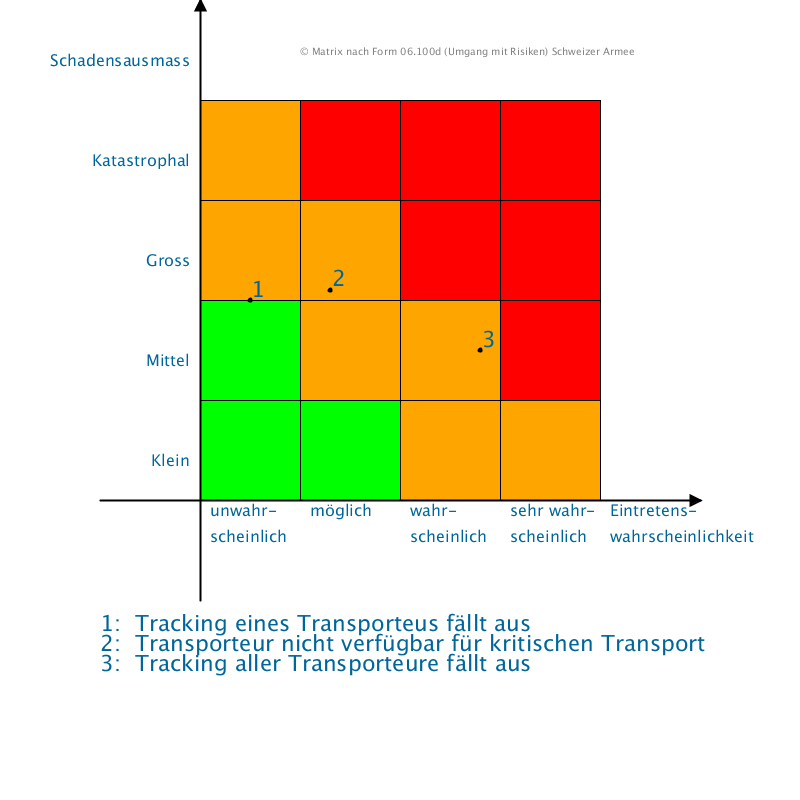

# RiskMatrix

## Benötigte Umgebung
Installation [Processing](https://processing.org/download/)

## Beispielmatrix


## Benutzung
1. RiskMatrix.pde in [Processing](https://processing.org/download/) öffnen  
2. Cases hinzufügen / anpassen
```processing
cases.add(new Case(2.8, 1.5, "Tracking aller Transporteure fällt aus"));
```
Wobei:
```processing
  Case(
      Wahrscheinlichkeit: float 0-4, 0-1 unwahrscheinlich ... 3-4 sehr wahrscheinlich
      Impact: float 0-4, 0-1 gering ... 3-4 katastrophal
      Text: String "Anzeige in Matrix",
      Description: String "Lange Bezeichnung"
  )
```
Die Cases werden von Links nach Rechts sortiert.  
3. Ausführen. Es wird dabei automatisch ein png erstellt. Eventuell muss bei ```size(x, y);``` die Höhe vergrössert werden.
